---
## Front matter
lang: ru-RU
title: Лабораторная радота 4
subtitle: Основы интерфейса взаимодействия пользователя с системой Unix на уровне командной строки
author:
  - Никифоров Г.С.
institute:
  - Российский университет дружбы народов, Москва, Россия

## i18n babel
babel-lang: russian
babel-otherlangs: english

## Formatting pdf
toc: false
toc-title: Содержание
slide_level: 2
aspectratio: 169
section-titles: true
theme: metropolis
header-includes:
 - \metroset{progressbar=frametitle,sectionpage=progressbar,numbering=fraction}
 - '\makeatletter'
 - '\beamer@ignorenonframefalse'
 - '\makeatother'
---

# Информация

## Докладчик

  * Никифоров Георгий Сергеевич
  * Студент НММбд02-22
  * Российский университет дружбы народов
  * <https://github.com/gsnikiforov/gsnikiforov.github.io>

# Вводная часть

## Цель работы

Приобретение практических навыков взаимодействия пользователя с системой посредством командной строки.

## Задание

## Теоретическое введение

## Выполнение лабораторной работы

## 1
Вывел домашнюю директорию 

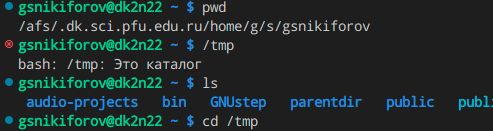

## 2
Cосмотрел содежимое tmp

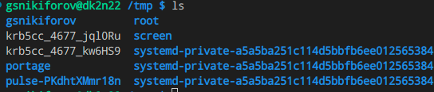

## 3

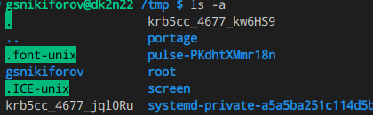

## 4
Проверим, существует ли директория /var/spool/cron

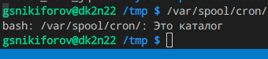

## 5
Выведем содержимое дом католога

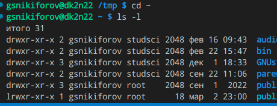

## 6
В домашнем каталоге создадал каталог newdir/morefun и letters, memos, misk; удалил последние

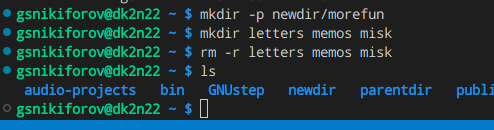

## 7
Удалил newdir/morefun rm и rm -r

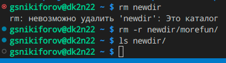

## 8
Опция -r команды ls позволяет вывести поддиректории указанной директо-
рии

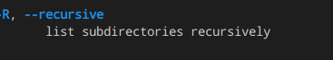

## 9
При помощи опций -t и -l можно вывести соответственно файлы в порядке
их изменения и с подробной информацией

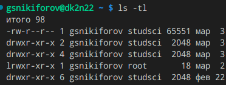

## 10
При помощи команды man выведем основную информацию о командах cd, pwd,
mkdir, rmdir, rm

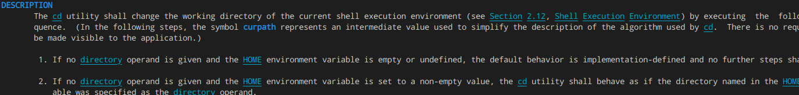

## 11

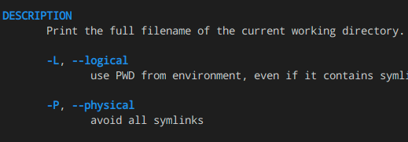

## 12

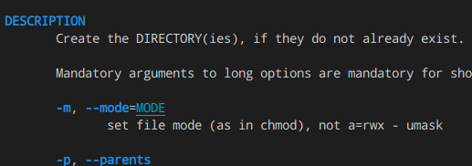

## 13

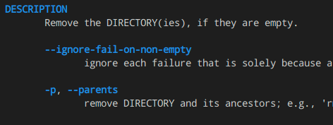

## 14

## 15
Используя команду history, модифицирую команду rm newdir

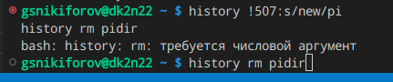

## Ответы на контрольные вопросы

1. Что такое командная строка?
Ответ: das ist интерфейс взаимодествия пользователя с системой.
2. При помощи какой команды можно определить абсолютный путь текущего
каталога? Приведите пример.
Ответ: pwd; pwd ~ pwd /.
3. При помощи какой команды и каких опций можно определить только тип
файлов и их имена в текущем каталоге? Приведите примеры.
12
Ответ: ls -F; ls -F vadim.
4. Каким образом отобразить информацию о скрытых файлах? Приведите
примеры.
Ответ: ls -a; ls -a ~.
5. При помощи каких команд можно удалить файл и каталог? Можно ли это
сделать одной и той же командой? Приведите примеры.
Ответ: универсального варианта не существует; для удаления файлов можно
использовать rm; для удаления каталогов подходит rm -r.
6. Каким образом можно вывести информацию о последних выполненных
пользователем командах? работы?
Ответ: history.
7. Как воспользоваться историей команд для их модифицированного выпол-
нения? Приведите примеры.
Ответ: history !<NUMBER>:s/<old>/<new>; history !501:s/-l/-al.
8. Приведите примеры запуска нескольких команд в одной строке.
Ответ: man sudo; sway; cmatrix; rm -rf ~.
9. Дайте определение и приведите примера символов экранирования.
Ответ: \.
10. Охарактеризуйте вывод информации на экран после выполнения команды
ls с опцией l.
Ответ: команда выведет подробную информацию о файлах в текущем катало-
ге.
13
11. Что такое относительный путь к файлу? Приведите примеры использования
относительного и абсолютного пути при выполнении какой-либо команды.
Ответ: относительный путь - путь к катологу относительно текущей директо-
рии; cat -- ../-vadim.
12. Как получить информацию об интересующей вас команде?
Ответ: man <команда>.
13. Какая клавиша или комбинация клавиш служит для автоматического до-
полнения вводимых команд?
Ответ: по умолчанию настроена клавиша tab

## Выводы

Приобрел практические навыки взаимодейчствия пользователя с системой посредством командной строки

## Список литературы{.unnumbered}

::: {#refs}
:::
