---
## Front matter
title: "Лабораторная работа 4"
subtitle: "Этап 1"
author: "Никифоров Георгий Сергеевич"

## Generic otions
lang: ru-RU
toc-title: "Ход работы"

## Bibliography
bibliography: bib/cite.bib
csl: pandoc/csl/gost-r-7-0-5-2008-numeric.csl

## Pdf output format
toc: true # Table of contents
toc-depth: 2
lof: true # List of figures
lot: true # List of tables
fontsize: 12pt
linestretch: 1.5
papersize: a4
documentclass: scrreprt
## I18n polyglossia
polyglossia-lang:
  name: russian
  options:
	- spelling=modern
	- babelshorthands=true
polyglossia-otherlangs:
  name: english
## I18n babel
babel-lang: russian
babel-otherlangs: english
## Fonts
mainfont: PT Serif
romanfont: PT Serif
sansfont: PT Sans
monofont: PT Mono
mainfontoptions: Ligatures=TeX
romanfontoptions: Ligatures=TeX
sansfontoptions: Ligatures=TeX,Scale=MatchLowercase
monofontoptions: Scale=MatchLowercase,Scale=0.9
## Biblatex
biblatex: true
biblio-style: "gost-numeric"
biblatexoptions:
  - parentracker=true
  - backend=biber
  - hyperref=auto
  - language=auto
  - autolang=other*
  - citestyle=gost-numeric
## Pandoc-crossref LaTeX customization
figureTitle: "Рис."
tableTitle: "Таблица"
listingTitle: "Листинг"
lofTitle: "Список иллюстраций"
lotTitle: "Список таблиц"
lolTitle: "Листинги"
## Misc options
indent: true
header-includes:
  - \usepackage{indentfirst}
  - \usepackage{float} # keep figures where there are in the text
  - \floatplacement{figure}{H} # keep figures where there are in the text
---

# Цель работы

Приобретение практических навыков взаимодействия пользователя с системой посредством командной строки.

# Задание

# Теоретическое введение

# Выполнение лабораторной работы

Вывел домашнюю директорию 

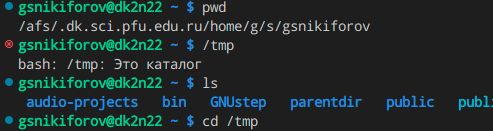

Cосмотрел содежимое tmp

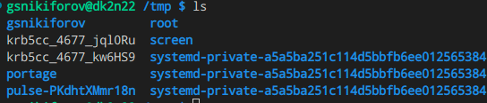

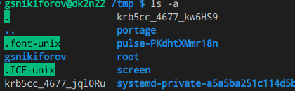

Проверим, существует ли директория /var/spool/cron

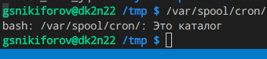

Выведем содержимое дом католога

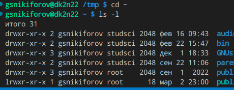

В домашнем каталоге создадал каталог newdir/morefun и letters, memos, misk; удалил последние

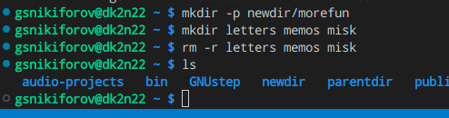

Удалил newdir/morefun rm и rm -r

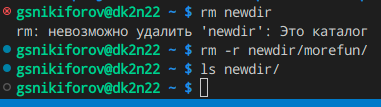

Опция -r команды ls позволяет вывести поддиректории указанной директо-
рии

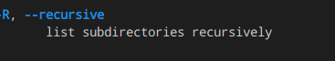

При помощи опций -t и -l можно вывести соответственно файлы в порядке
их изменения и с подробной информацией

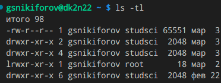

При помощи команды man выведем основную информацию о командах cd, pwd,
mkdir, rmdir, rm

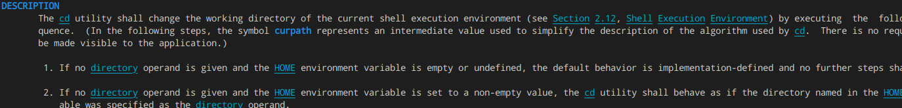

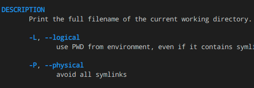

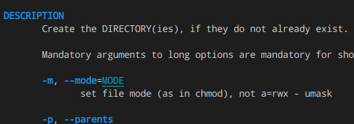

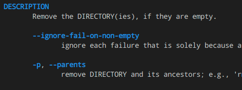

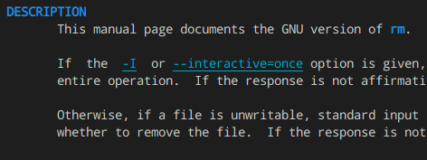

Используя команду history, модифицирую команду rm newdir

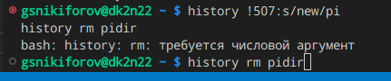

# Ответы на контрольные вопросы

1. Что такое командная строка?
Ответ: das ist интерфейс взаимодествия пользователя с системой.
2. При помощи какой команды можно определить абсолютный путь текущего
каталога? Приведите пример.
Ответ: pwd; pwd ~ pwd /.
3. При помощи какой команды и каких опций можно определить только тип
файлов и их имена в текущем каталоге? Приведите примеры.
12
Ответ: ls -F; ls -F vadim.
4. Каким образом отобразить информацию о скрытых файлах? Приведите
примеры.
Ответ: ls -a; ls -a ~.
5. При помощи каких команд можно удалить файл и каталог? Можно ли это
сделать одной и той же командой? Приведите примеры.
Ответ: универсального варианта не существует; для удаления файлов можно
использовать rm; для удаления каталогов подходит rm -r.
6. Каким образом можно вывести информацию о последних выполненных
пользователем командах? работы?
Ответ: history.
7. Как воспользоваться историей команд для их модифицированного выпол-
нения? Приведите примеры.
Ответ: history !<NUMBER>:s/<old>/<new>; history !501:s/-l/-al.
8. Приведите примеры запуска нескольких команд в одной строке.
Ответ: man sudo; sway; cmatrix; rm -rf ~.
9. Дайте определение и приведите примера символов экранирования.
Ответ: \.
10. Охарактеризуйте вывод информации на экран после выполнения команды
ls с опцией l.
Ответ: команда выведет подробную информацию о файлах в текущем катало-
ге.
13
11. Что такое относительный путь к файлу? Приведите примеры использования
относительного и абсолютного пути при выполнении какой-либо команды.
Ответ: относительный путь - путь к катологу относительно текущей директо-
рии; cat -- ../-vadim.
12. Как получить информацию об интересующей вас команде?
Ответ: man <команда>.
13. Какая клавиша или комбинация клавиш служит для автоматического до-
полнения вводимых команд?
Ответ: по умолчанию настроена клавиша tab

# Выводы

Приобрел практические навыки взаимодейчствия пользователя с системой посредством командной строки

# Список литературы{.unnumbered}

::: {#refs}
:::
