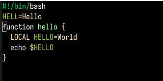
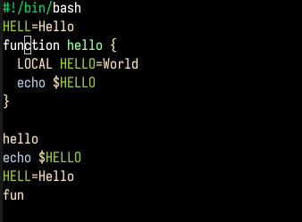
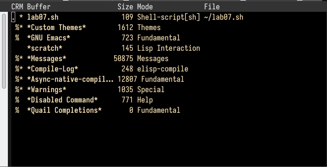
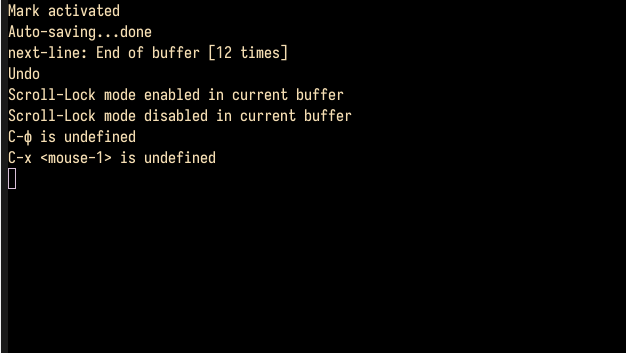
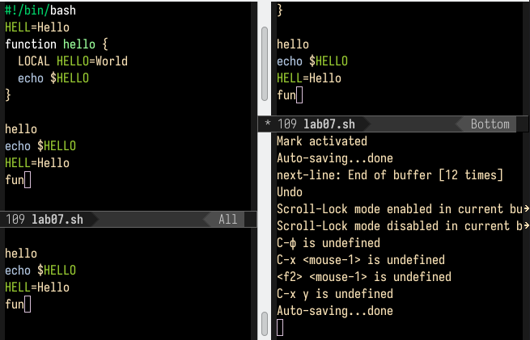
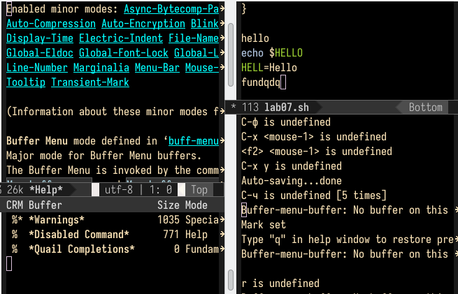
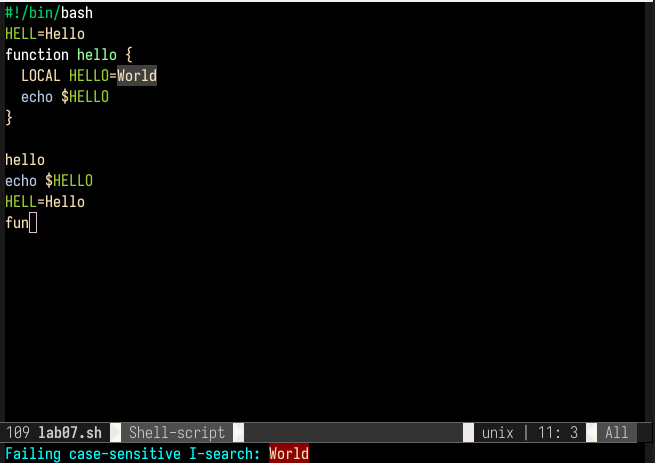

---
## Front matter
lang: ru-RU
title: Лабораторная работа №9
subtitle: Текстовый редактор emacs
author:
  - Никифоровгей
institute:
  - Российский университет дружбы народов, Москва, Россия, планета Земля
date: 22 марта 2023 XXI

## i18n babel
babel-lang: russian
babel-otherlangs: english

## Formatting pdf
toc: false
toc-title: Содержание
slide_level: 2
aspectratio: 169
section-titles: true
theme: metropolis
header-includes:
 - \metroset{progressbar=frametitle,sectionpage=progressbar,numbering=fraction}
 - '\makeatletter'
 - '\beamer@ignorenonframefalse'
 - '\makeatother'
---

# Информация

## Докладчик

:::::::::::::: {.columns align=center}
::: {.column width="70%"}

  * Никифоров Георгий Серегеевич
  * студентов
  * студент
  * студентович
  * Математический институт им. Никольского
  * <https://github.com/ivmulin>

:::
::::::::::::::

# Вводная часть

## Актуальность

- Умение взаимодействовать с текстовым редактором emacs вызывает уважение среди соратников.

# Ход работы

## Цель работы
Цель работы — познакомиться с интерфейсом текстового редактора emacs. 

# Выполнение лабораторной работы

## Ознакомление с emacs

В редакторе emacs создали новый фапедикйл lab09.sh и ввели следующий код:

``` bash
#!/bin/bash
HELL=Hello
function hello {
    LOCAL HELLO=World
    echo $HELLO
}
echo $HELLO
hello
```

## Ознакомление с emacs

Сохранили файл:



## Ознакомление с emacs

Затем по порядку выполнили следующие махинации над текстом:
1. Вырезали строку при помощи комбинации клавиш `C-k`
2. Вставили эту строку в конце файла (`C-y`)
3. Выделили область текста (`C-space`)
4. Скопировали область в буфер обмена (`M-w`)
5. Вставили область в конец файла
6. Вырезали ту же область (`C-w`)
7. Отменили последнее действие (`C-\`)

## Ознакомление с emacs



## Перемещение по документу

Далее научились перемещать курсор в начало строки (`C-a`), в конец строки (`C-e`), в начало буфера (`M-<`) и конец буфера (`M->`).

## Управление бхуйуферами

Вывели список активных буферов на экран (`C-x C-b`):



## Управление буферами

Переместились в открытое окно. Следом закрыли это окно (`C-x 0`). Вновь переключились между буферами, но уже без вывода их списка на экран (`C-x b`).



## Управление окнами

При помощи сочетаний клавиш `C-x 3` и `C-x 2` поделили фрейм сначала по вертикали, а затем дважды по горизонтали:



## Управление окнами

В каждом окне открыли новый буфер и ввели там несколько строк:



## Режим поиска

В режиме поиска (`C-s`) нашли слово _World_:



## Режим поиска

Вышли из режима поиска (`C-g`):


## Режим поиска

Выполнили замену текста (`M-%`):


## Режим поиска

Выполнили поиск уже причмо помощи сочетания клавиш `M-s`:


## Режим поиска

От первого режима отличается тем, что выполняет поиск по словам целиком и при нахождении совпадения переводит каретку в конец первого совпадения. Первый режим текста находит любое совпадение.


## Ответы на контрольные вопросы

1. Кратко охарактеризуйте редактор emacs.

_Ответ_: emacs — экранный редактор текста.

## Ответы на контрольные вопросы

2. Какие особенности данного редактора могут сделать его сложным для освоения новичком?

_Ответ_: совершенно не поддающиеся какой бы то ни было логике сочетания клавиш поставят любого пользователя в тупик. Удачи.

## Ответы на контрольные вопросы

3. Своими словами опишите, что такое буфер и окно в терминологии emacs’а.

_Ответ_: буфер — хранилище текста, окно — хранилище буферов.

## Ответы на контрольные вопросы

4. Можно ли открыть больше 10 буферов в одном окне?

_Ответ_: оказалось, что нет.

## Ответы на контрольные вопросы

5. Какие буферы создаются по умолчдураканию при запуске emacs?

_Ответ_: 'GNU Emacs' и \*Warnings\*.

## Ответы на контрольные вопросы

6. Какие клавиши вы нажмёте, чтобы ввести следующую комбинацию C-c | и C-c C-|?

_Ответ_: `ctrl-c-shift-\` и `ctrl-c ctrl-shift-\`.

## Ответы на контрольные вопросы

7. Как поделить текущее окно на две части?

_Ответ_: по горизонтали (`C-x 2`) и по вертикали (`C-x 3`).

## Ответы на контрольные вопросы

8. В каком файле хранятся настройки редактора emacs?

_Ответ_: `~/.emacs`.

## Ответы на контрольные вопросы

9. Какую функцию выполняет клавиша -> и можно ли её переназначить?

_Ответ_: перемещение каретки по буфсынокеру. Переназначить нельзя.

## Ответы на контрольные вопросы

10. Какой редактор вам показался удобнее в работе: vi или emacs? Поясните почему.

_Ответ_: vi оказался удобнее ввиду своей легковесности.

# Результаты

## Заключение строго режима на 5 лет

В ходе выполнения лабораторной работы был изучен интерфейс текстового редактора emacs. Цель работы была достигнута.

