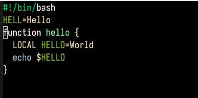
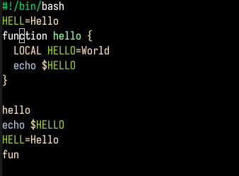
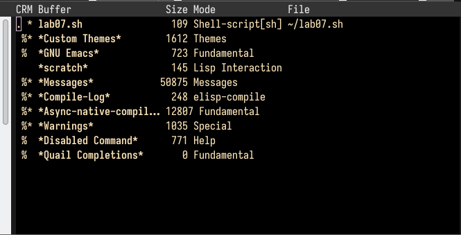
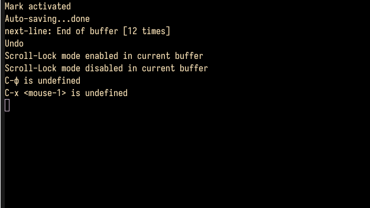
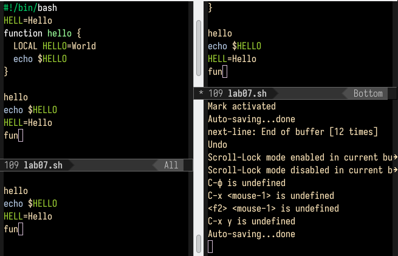
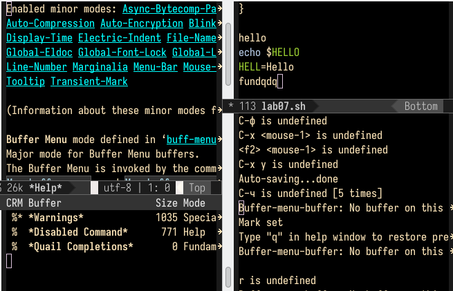
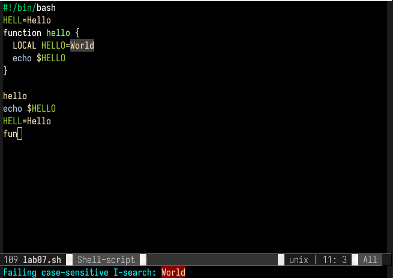

---
## Front matter
title: "Отчёт по лабораторной работе №9"
subtitle: "Текстовый редактор emacs"
author: "Гоша"

## Generic otions
lang: ru-RU
toc-title: "Содержание"

## Bibliography
## bibliography: bib/cite.bib
csl: pandoc/csl/gost-r-7-0-5-2008-numeric.csl

## Pdf output format
toc: true # Table of contents
toc-depth: 2
lof: true # List of figures
lot: false # List of tables
fontsize: 12pt
linestretch: 1.5
papersize: a4
documentclass: scrreprt
## I18n polyglossia
polyglossia-lang:
  name: russian
  options:
	- spelling=modern
	- babelshorthands=true
polyglossia-otherlangs:
  name: english
## I18n babel
babel-lang: russian
babel-otherlangs: english
## Fonts
mainfont: PT Serif
romanfont: PT Serif
sansfont: PT Sans
monofont: PT Mono
mainfontoptions: Ligatures=TeX
romanfontoptions: Ligatures=TeX
sansfontoptions: Ligatures=TeX,Scale=MatchLowercase
monofontoptions: Scale=MatchLowercase,Scale=0.9
## Biblatex
biblatex: true
biblio-style: "gost-numeric"
biblatexoptions:
  - parentracker=true
  - backend=biber
  - hyperref=auto
  - language=auto
  - autolang=other*
  - citestyle=gost-numeric
## Pandoc-crossref LaTeX customization
figureTitle: "Рис."
tableTitle: "Таблица"
listingTitle: "Листинг"
lofTitle: "Список иллюстраций"
lotTitle: "Список таблиц"
lolTitle: "Листинги"
## Misc options
indent: true
header-includes:
  - \usepackage{indentfirst}
  - \usepackage{float} # keep figures where there are in the text
  - \floatplacement{figure}{H} # keep figures where there are in the text
---

## Цель работы
Цель работы — познакомиться с интерфейсом текстового редактора emacs. 

# Выполнение лабораторной работы

## Ознакомление с emacs

В редакторе emacs создали новый файл lab09.sh и ввели следующий код:

``` bash
#!/bin/bash
HELL=Hello
function hello {
    LOCAL HELLO=World
    echo $HELLO
}
echo $HELLO
hello
```

Сохранили файл:



Затем по порядку выполнили следующие махинации над текстом:
1. Вырезали строку при помощи комбинации клавиш `C-k`
2. Вставили эту строку в конце файла (`C-y`)
3. Выделили область текста (`C-space`)
4. Скопировали область в буфер обмена (`M-w`)
5. Вставили область в конец файла
6. Вырезали ту же область (`C-w`)
7. Отменили последнее действие (`C-\`)



## Перемещение по документу

Далее научились перемещать курсор в начало строки (`C-a`), в конец строки (`C-e`), в начало буфера (`M-<`) и конец буфера (`M->`).

## Управление буферами

Вывели список активных буферов на экран (`C-x C-b`):



Переместились в открытое окно. Следом закрыли это окно (`C-x 0`). Вновь переключились между буферами, но уже без вывода их списка на экран (`C-x b`).



## Управление окнами

При помощи сочетаний клавиш `C-x 3` и `C-x 2` поделили фрейм сначала по вертикали, а затем дважды по горизонтали:



В каждом окне открыли новый буфер и ввели там несколько строк:



## Режим поиска

В режиме поска (`C-s`) нашли слово _World_:



Вышли из режима поиска (`C-g`):


Выполнили замену текста (`M-%`):


Выполнили поиск уже при помощи сочетания клавиш `M-s`:


От первого режима отличается тем, что выполняет поиск по словам целиком и при нахождении совпадения переводит каретку в конец первого совпадения. Первый режим текста находит любое совпадение.


## Ответы на контрольные вопросы

1. Кратко охарактеризуйте редактор emacs.

_Ответ_: emacs — экранный редактор текста.

2. Какие особенности данного редактора могут сделать его сложным для освоения новичком?

_Ответ_: совершенно не поддающиеся какой бы то ни было логике сочетания клавиш поставят любого пользователя в тупик. Удачи.

3. Своими словами опишите, что такое буфер и окно в терминологии emacs’а.

_Ответ_: буфер — хранилище текста, окно — хранилище буферов.

4. Можно ли открыть больше 10 буферов в одном окне?

_Ответ_: оказалось, что нет.

5. Какие буферы создаются по умолчанию при запуске emacs?

_Ответ_: 'GNU Emacs' и \*Warnings\*.

6. Какие клавиши вы нажмёте, чтобы ввести следующую комбинацию C-c | и C-c C-|?

_Ответ_: `ctrl-c-shift-\` и `ctrl-c ctrl-shift-\`.

7. Как поделить текущее окно на две части?

_Ответ_: по горизонтали (`C-x 2`) и вертикали (`C-x 3`).

8. В каком файле хранятся настройки редактора emacs?

_Ответ_: `~/.emacs`.

9. Какую функцию выполняет клавиша и можно ли её переназначить?

_Ответ_: перемещение каретки по буферу. Переназначить нельзя.

10. Какой редактор вам показался удобнее в работе vi или emacs? Поясните почему.

_Ответ_: vi оказался удобнее ввиду своей легковесности.


## Заключение

В ходе выполнения лабораторной работы был изучен интерфейс текстового редактора emacs. Цель работы была достигнута.

