---
## Front matter
lang: ru-RU
title: Индивидуальный Проект
subtitle: Этап 1
author:
  - Никифоров Г.С.
institute:
  - Российский университет дружбы народов, Москва, Россия

## i18n babel
babel-lang: russian
babel-otherlangs: english

## Formatting pdf
toc: false
toc-title: Содержание
slide_level: 2
aspectratio: 169
section-titles: true
theme: metropolis
header-includes:
 - \metroset{progressbar=frametitle,sectionpage=progressbar,numbering=fraction}
 - '\makeatletter'
 - '\beamer@ignorenonframefalse'
 - '\makeatother'
---

# Информация

## Докладчик

  * Никифоров Георгий Сергеевич
  * Студент НММбд02-22
  * Российский университет дружбы народов
  * <https://github.com/gsnikiforov/gsnikiforov.github.io>

# Целеустремленность

## Цель работы

Создать сайт, привязанный к созданным репозиториям

# Задание

# Теоретическое введение

# Выполнение лабораторной работы

## Создал репозиторий для сайта

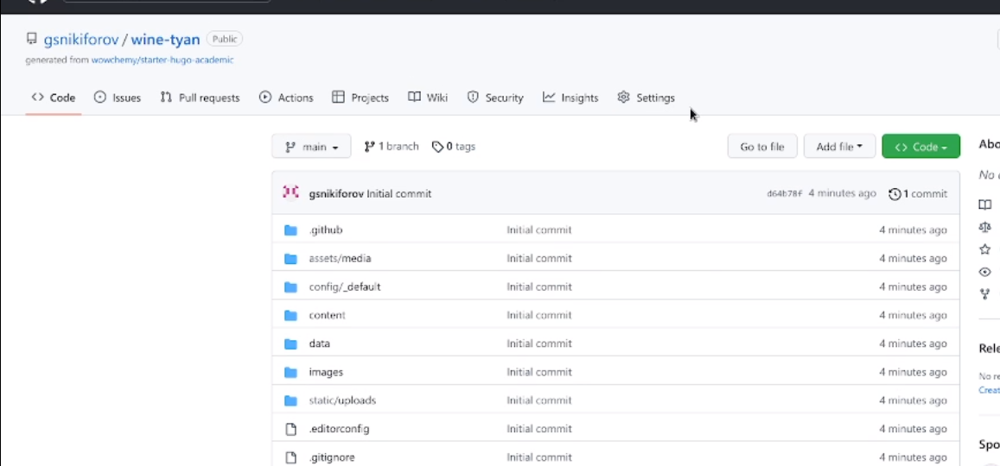

## Клонировал его на ПК

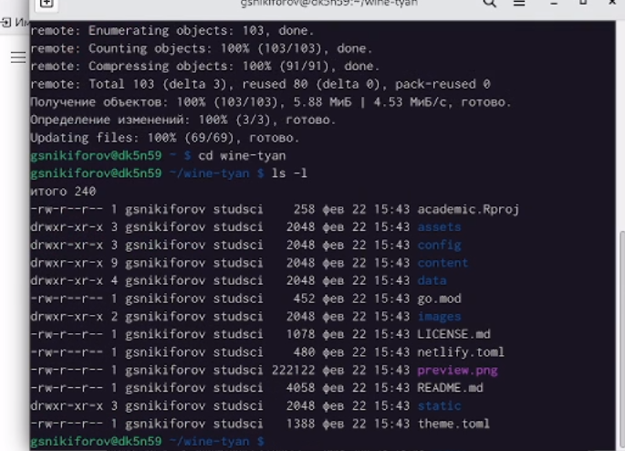

## Проверил файлы

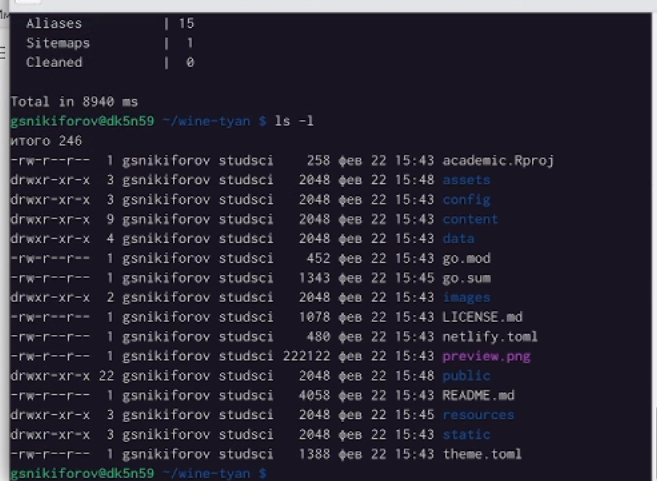

## Удалил паблик

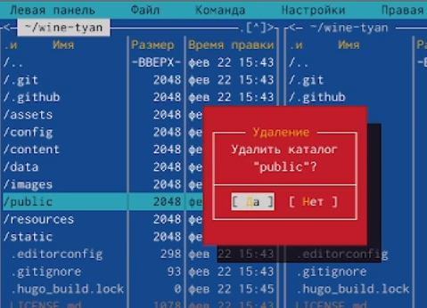

## Вызвал хюго сервер

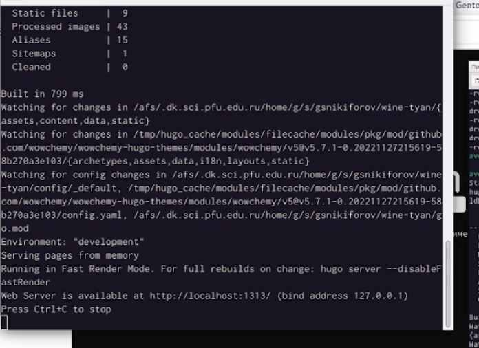

## Получил локалхост

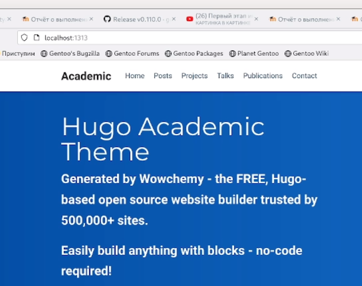

## Создаем пустой доп репозиторий с основными файлами сайта

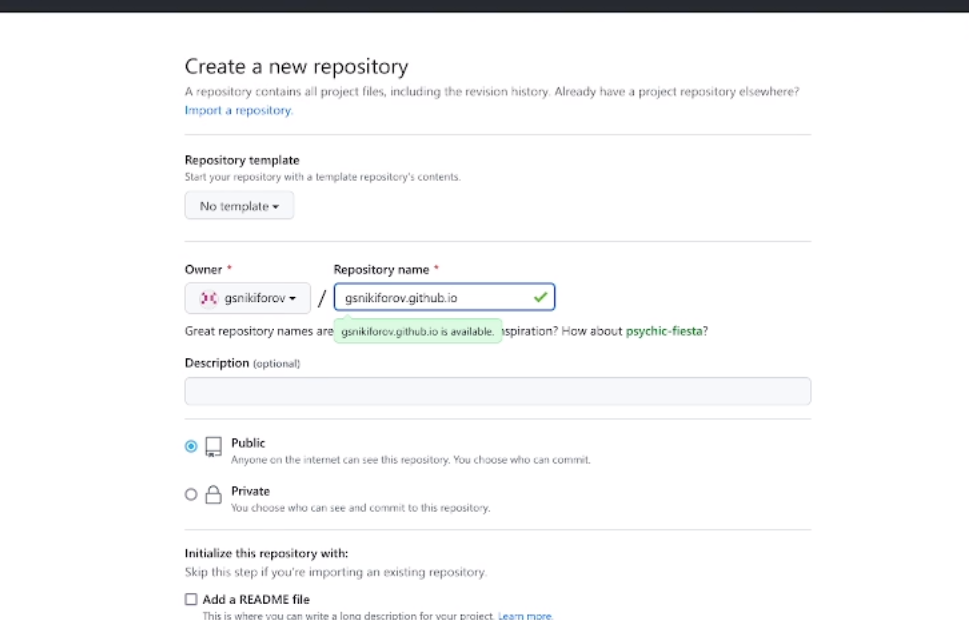

## Создал в репозитории текст файл и подключил репозиторий к основной ветке

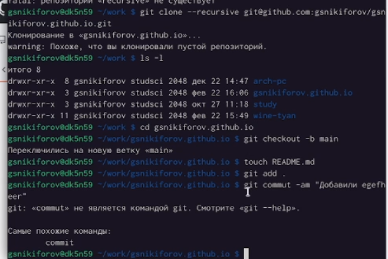

## Объединил репозитории по ветке main

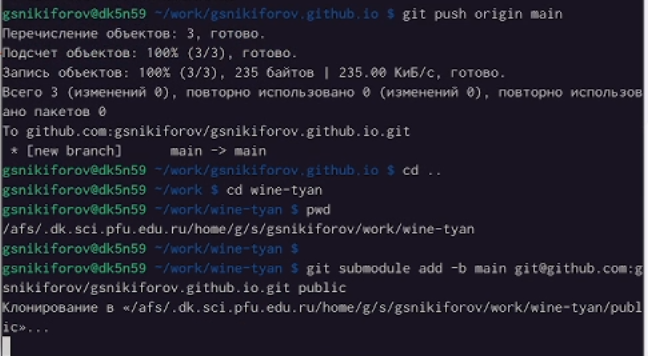

## Закомментировал public

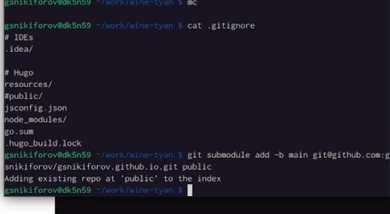

## Объединил по мейн ветке с учетом игнорирования паблик

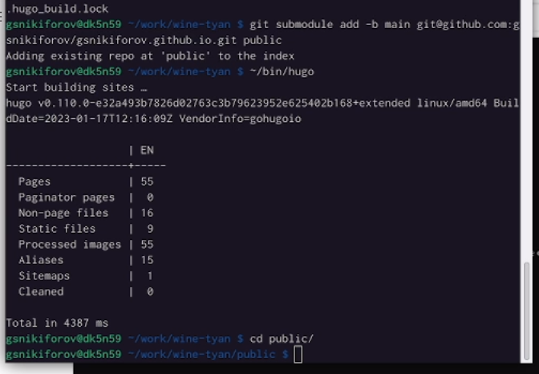

## git pushнул

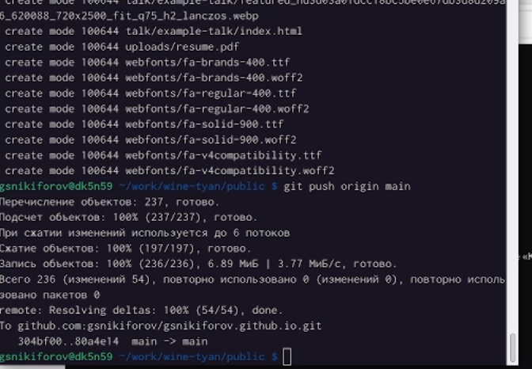

## САЙТЁ!!!!!!!!!!

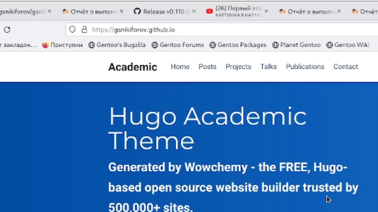

#  Заключение

## Выводы

Сделал локальный сайт объеденный с репозиториями, научился этому)))))))

