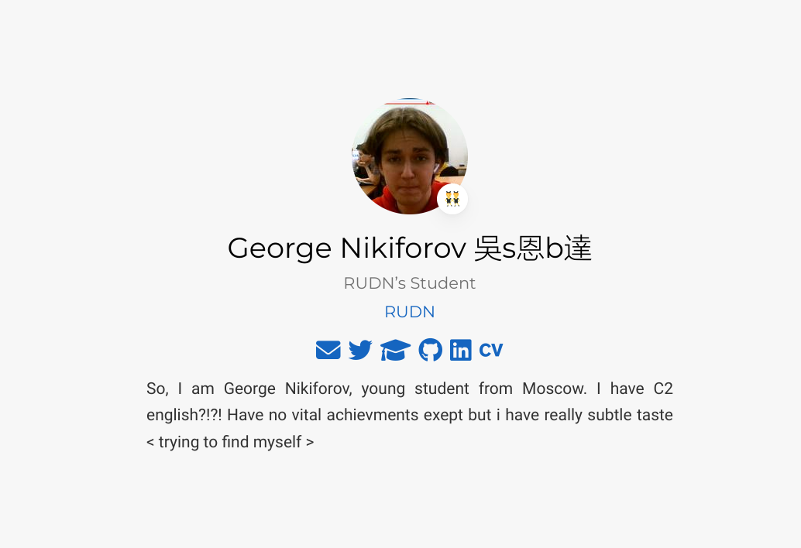
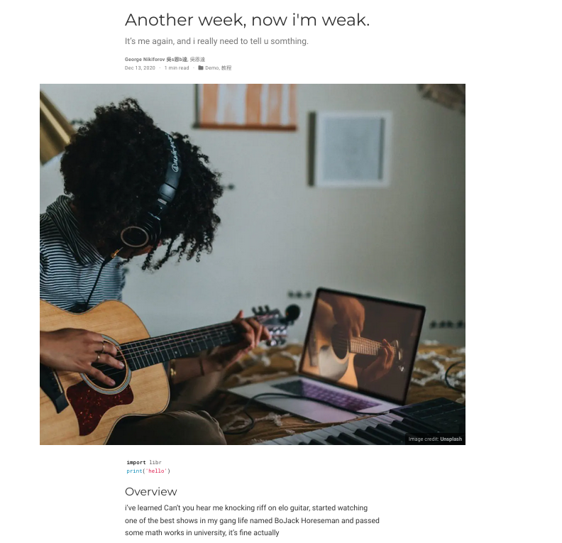
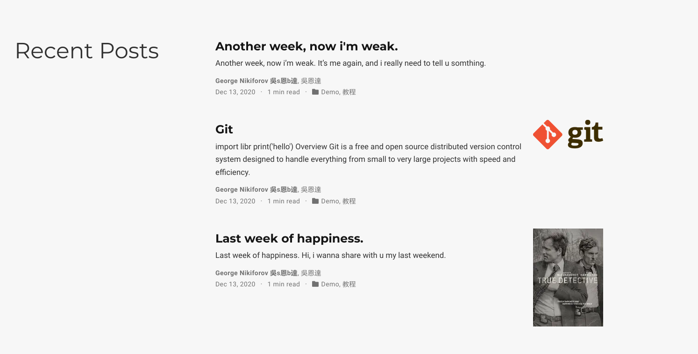

---
## Front matter
lang: ru-RU
title: Индивидуалный проект
subtitle: Этап 4
author:
  - Никифоров Г.
institute:
  - Российский университет дружбы народов, Москва, Россия
date: 28 апреля 2023

## i18n babel
babel-lang: russian
babel-otherlangs: english

## Formatting pdf
toc: false
toc-title: Содержание
slide_level: 2
aspectratio: 169
section-titles: true
theme: metropolis
header-includes:
 - \metroset{progressbar=frametitle,sectionpage=progressbar,numbering=fraction}
 - '\makeatletter'
 - '\beamer@ignorenonframefalse'
 - '\makeatother'
---

# Информация

## Докладчик

:::::::::::::: {.columns align=center}
::: {.column width="70%"}

  * Никифоров Георгий Сергеевич
  * студент НМММММбд-02-22
  * всё ещё по-прежнему студент
  * Математический институт им. Никольского
  * <https://github.com/gsnikiforov>

:::
::::::::::::::

# Вводная часть

## Цель работы

Цель сей работы - добавить ссылки на социальные сети и написать два поста.

# Выполнение этапа 4

Добавили ссылки на социальные сети:

Добавили статью о языках научного программирования:

Написали пост о прошедшей неделе:

# Заключение
В результате выполнения данной работы были добавлены ссылки на социальные сети и два поста. Цель работы была достигнута.

